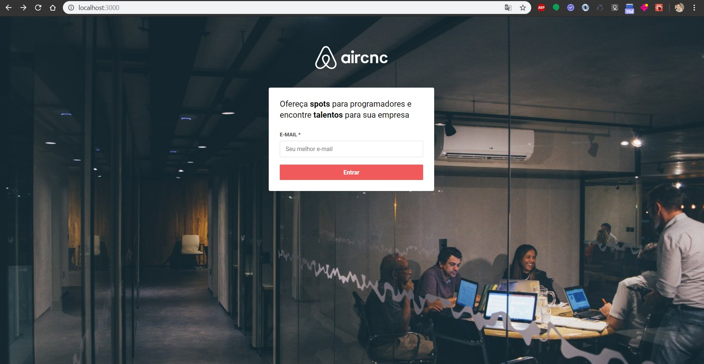
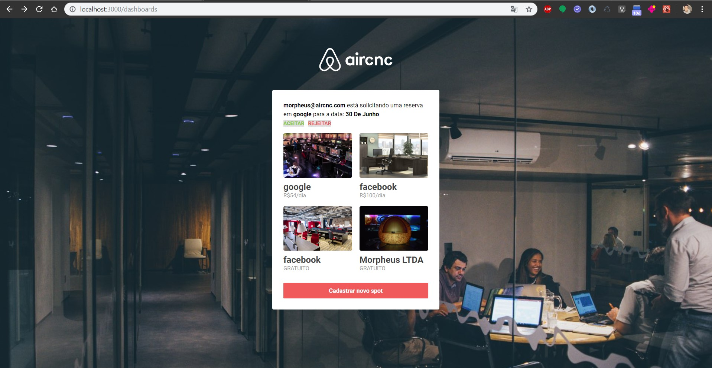

<p align="center">

</p>

# AirCnC | Code & Coffee <br/>

### Projeto apenas para fins de estudo sem nenhum envolvimento com a marca Airbnb.

## Stack
- Backend: NodeJS Express
- Frontend: React
- Mobile: React Native

## Running everything locally

```bash
docker compose up --build
```

Starts MongoDB, the backend API (`:3333`), and the frontend (`:3000`) - no local
Node/Yarn install needed. A `mobile` service (Expo web, `:19006`) is also included but is
best-effort only; see the comments in `docker-compose.yml` for its current known issue.

# ScreenShots

- Web




- Mobile


